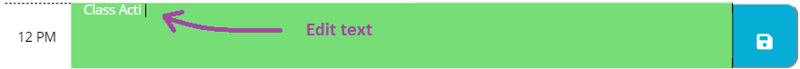

# homework5
Name

"Web APIs (jQuery), "Work Day Scheduler".

instruction 
(Hold "Ctrl" key while you click on image "sample.png" to visualize)

  step 1

  

  -Open URL at the end of this ReadMe file, (recomended Browser: Google Chrome).

  step 2

    -Application instructions:
    - Insert text in the corresponding box.
    - Press on the respective "Save Button", in order to save your text.
    - After you save, you can reload the page without losing your "plans for the day".

  step 3

  

  -The App will display automaticly the current Date on top of the screen, as the picture shows.

  step 4

  

  -The App knows what's your current time, and it will display different Box colors accordingly to that.

  step 5

  

  -Write your plans for a specific hour on that Day.

  

  -If the Box has content already, you can easily edit it just clicking inside and changing the text.

  step 6 - IMPORTANT!

  

  -Any changes inside the Boxes will be save ONLY after clicking respective "Save Button", located on your right side of the screen.

  

Description

"Work Day Scheduler" is an app tha will help you remember and organize your plans during the day. This app will run in the browser and feature dynamically updated HTML and CSS powered by JavaScript (using jQuery and moment.js code). It also feature a clean and polished user interface and is responsive, ensuring that it adapts to multiple screen sizes.
like: CellPhones "640px", Tablets "768px", and Laptops "980px".

Details

This repository content the html files: index "main page", the CSS styles "style.css", the JavaScript "script.js" and an "image" folder with the captures for this Readme File.

URL 

The URL to open the page on your Browser is "https://diegolehyt.github.io/homework5/"